# 🔰GnuWin32をさわってみる

## 🔰GnuWin32とは？

そもそもGNU Projectというものがある。

GNU ProjectはエディタのemacsやUnix/Linuxコマンドのgrep,sed等々の有名なソフトウェアを開発しているプロジェクト。

[GNUソフトウェア](https://www.gnu.org/software/software.html)

このGNU Projectで配布されたソフトウェアのいくつかをWindowsに移植したのが [GnuWin32](http://gnuwin32.sourceforge.net/)。

## 🔰ためしにsedをインストールしてみる。

[sed for Windows](http://gnuwin32.sourceforge.net/packages/sed.htm)

GnuWin32 sed ダウンロードの所から必要な物をダウンロード。

今回は、Complete package, except sourcesからsed-4.2.1-setup.exeをダウンロードします。


ダウンロードできました。実行してインストールします。

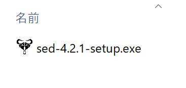

実行するとインストーラが立ち上がるので適宜選択してインストールします。

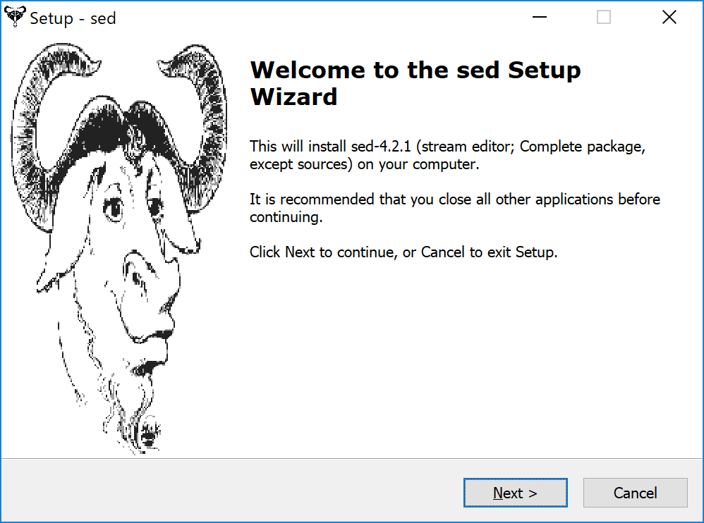

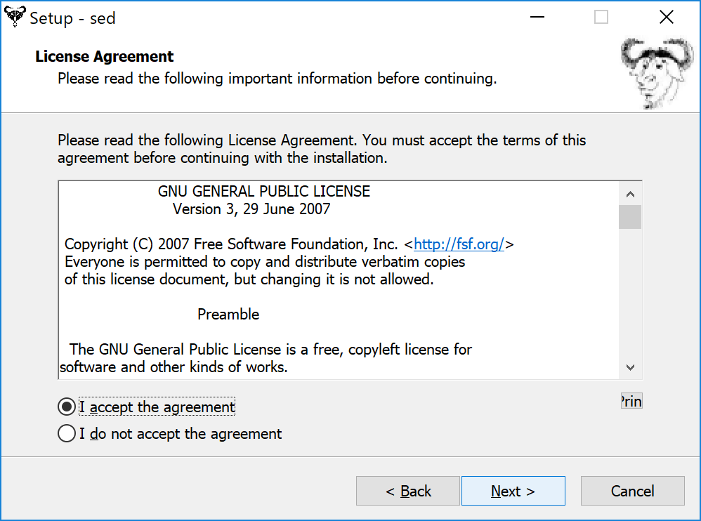

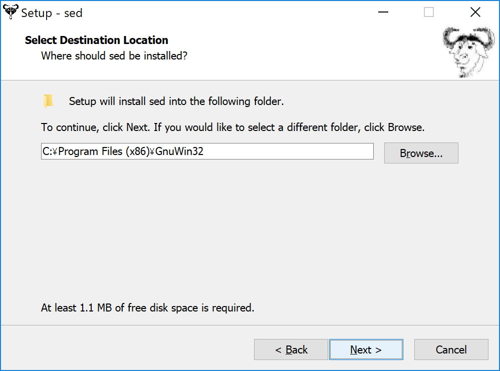

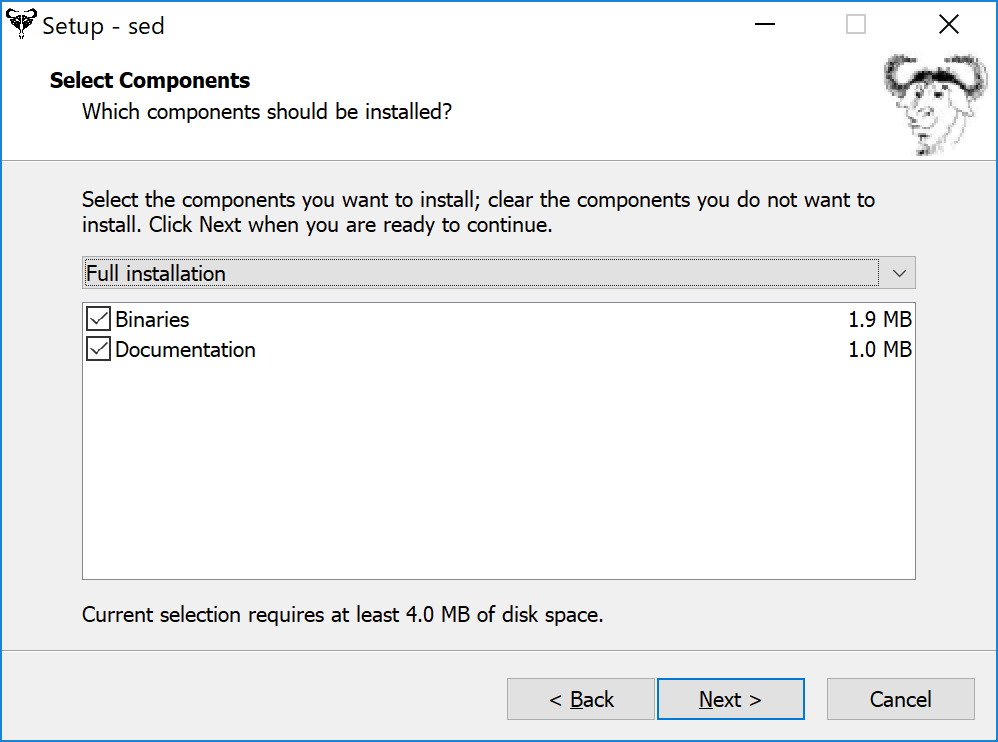

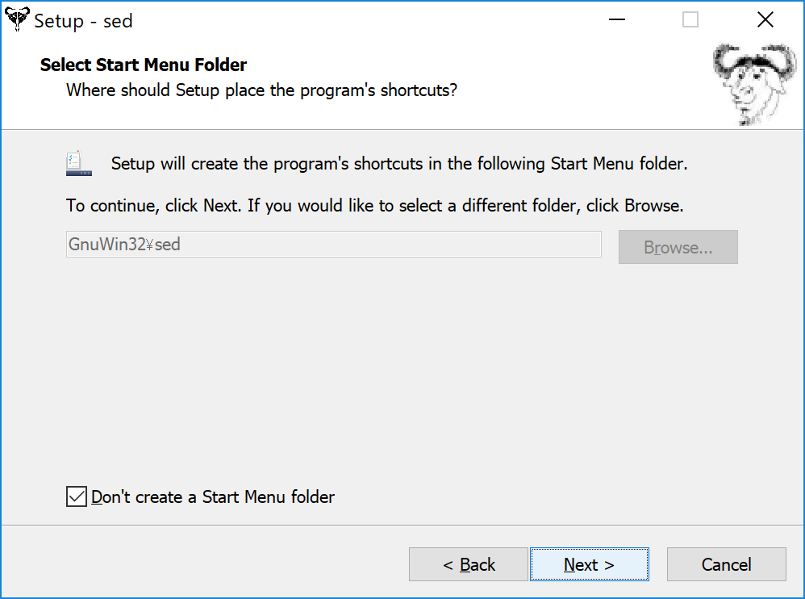

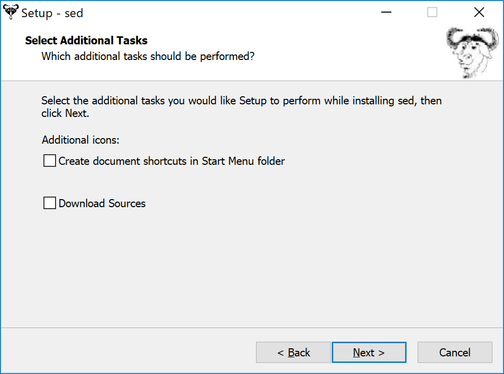

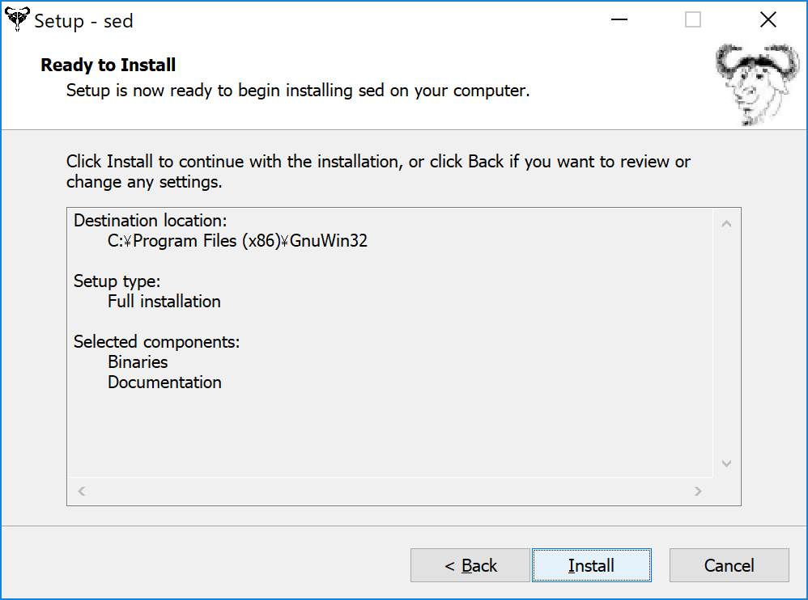

インストールできました。

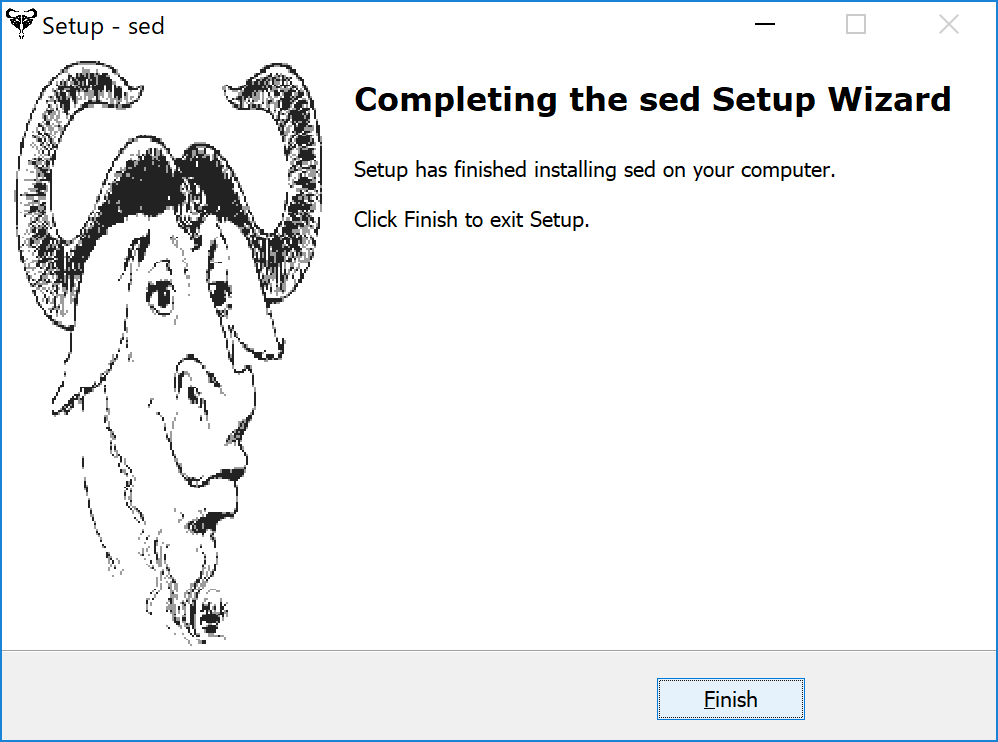

インストールした後は、インストールしたディレクトリを環境ヘンスのPATHに追加しておきます。

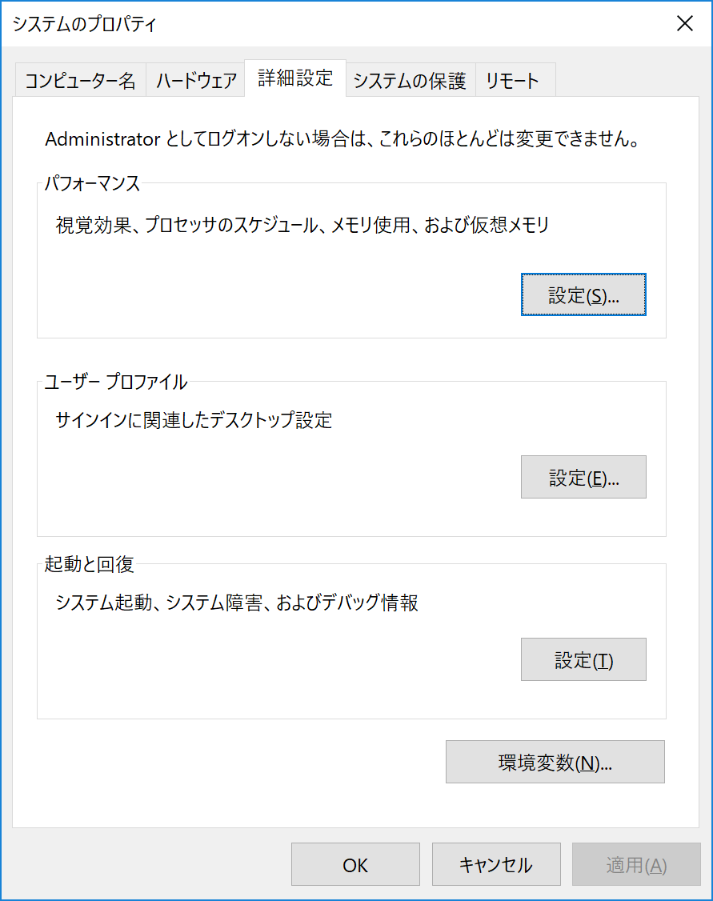

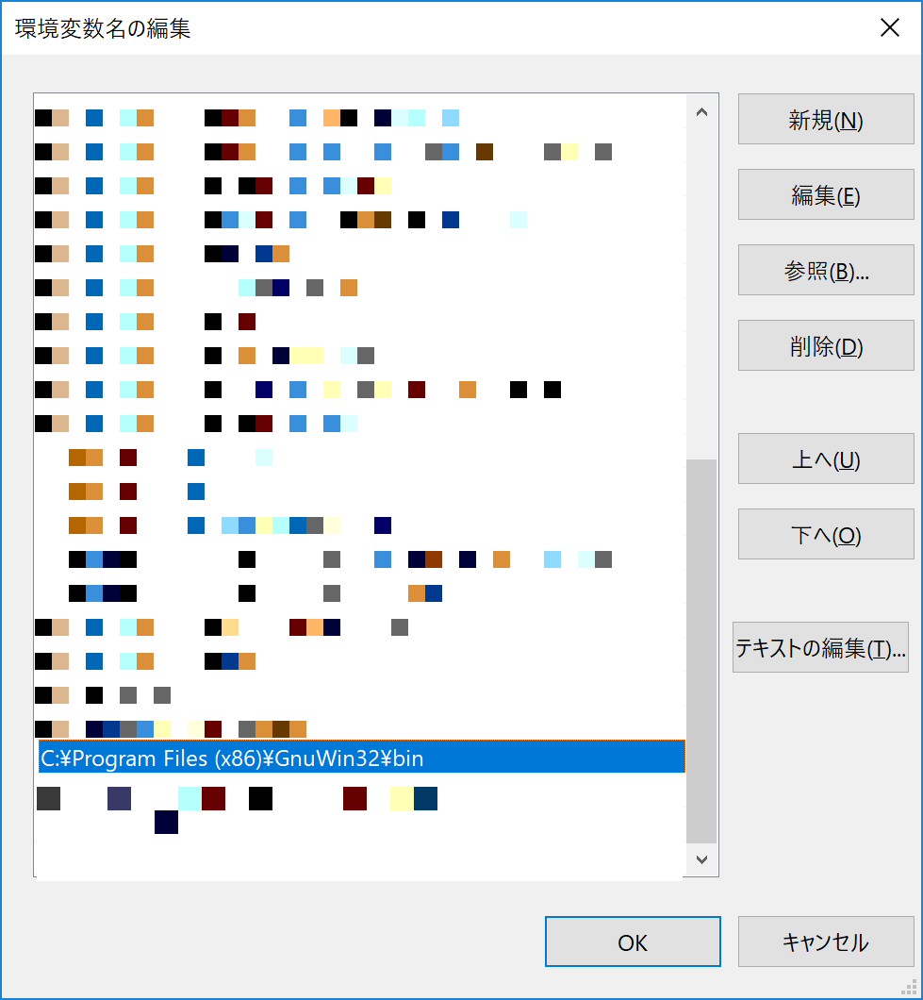

## インストールしたsedを使ってみる

Powershellを使ってsedに対して

helloという文字列を渡し、helloをworldに置換してみる。

```powershell
"hello" | sed s/hello/world/
```


## 総評

最近はWSL(Windows Subsystem for Linux)とかもありますが。

Unix/LinuxなコマンドをちょっとWindowsで使いたいという場合はGnuWin32は便利ですね。
